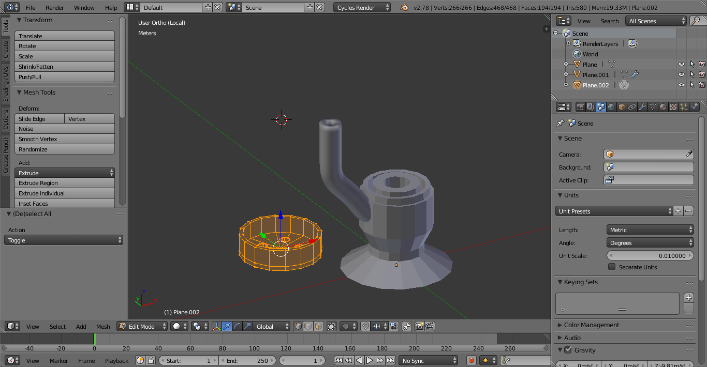

# Lektion 2: Tröte

In dieser Lektion soll eine Tröte, also ein ganz einfaches Blasinstrument/ Krachmacher, konstruiert werden. Im Anschluss kann das Resultat auf einem 3D-Drucker ausgedruckt werden - etwa im [Makerspace der SLUB Dresden](http://www.slub-dresden.de/service/arbeitsplaetze-arbeitsraeume/slub-makerspace/).

Zwischen die beiden Teile wird bei Zusammenstecken eine Gummimembran gespannt. Anschließend kann durch das Mundstück hineingeblasen werden, wodurch die Membran hörbar in Schwingung versetzt wird.

> Durch das konstruieren und 3D-Drucken habe ich viel gelernt. Beim Ausprobieren der ersten Version fiel mir zudem auf, das mir ein kleiner Konstruktionsfehler unterlaufen ist, aus dem für zukünftige Projekte gelernt habe.

